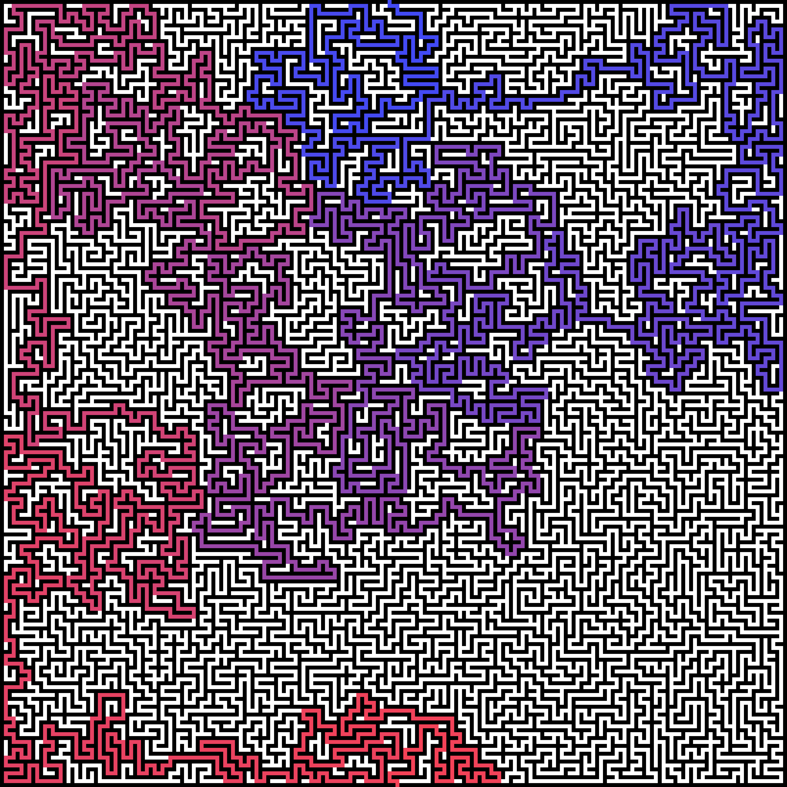

# Python Collection
A selection of scripts I am working on in my spare time

## SolveMaze.py
A small program that reads a png of a maze and tries to find a solution to it. Uses Dijkstra's Algorithm. Here's a real solved maze which took about 200 seconds to compute:

## Login/
A fully working login system, complete with session handling and some basic encryption.

## cat-fact.py
A program that sends a request to the cat-facts API and returns a random cat fact.

## Game/
A basic rpg-like grid based game I am working on. I might dedicate a separate repo for it in the future.

## BlackJack/
A simple game where you play blackjack, pretty self-explanatory.

## Imaging/
Some experimental imaging programs

## Outliner/
A program that lets you calculate the sum, average and median of datasets

## alphagen.py
Generates a random string with the given length provided by the user

## Cipher.py
A basic Caesar-cipher.

## SlidePuzzle.py
A simple sliding puzzle.
